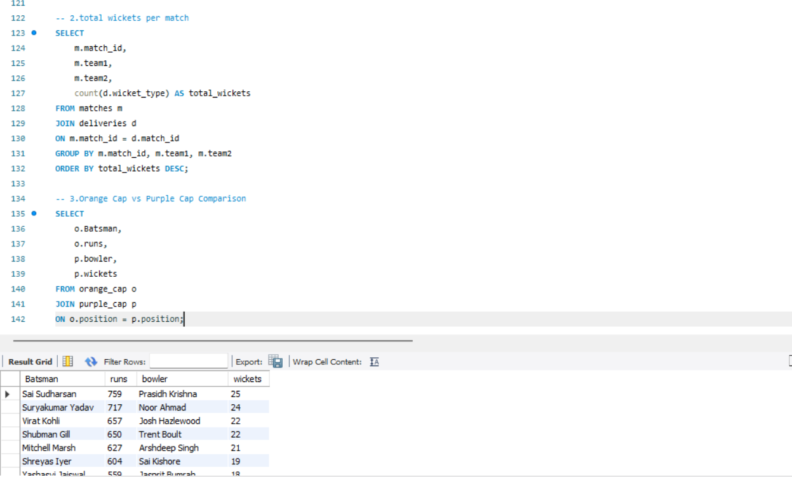
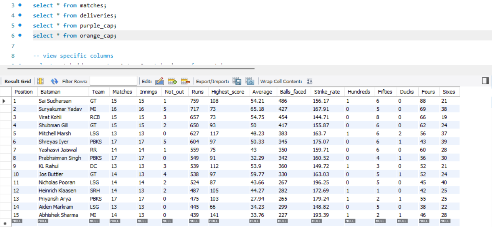
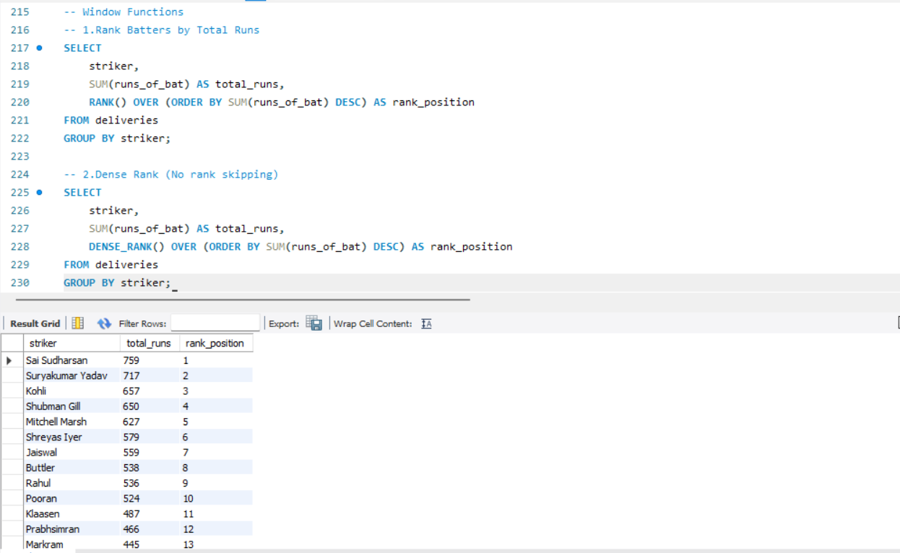
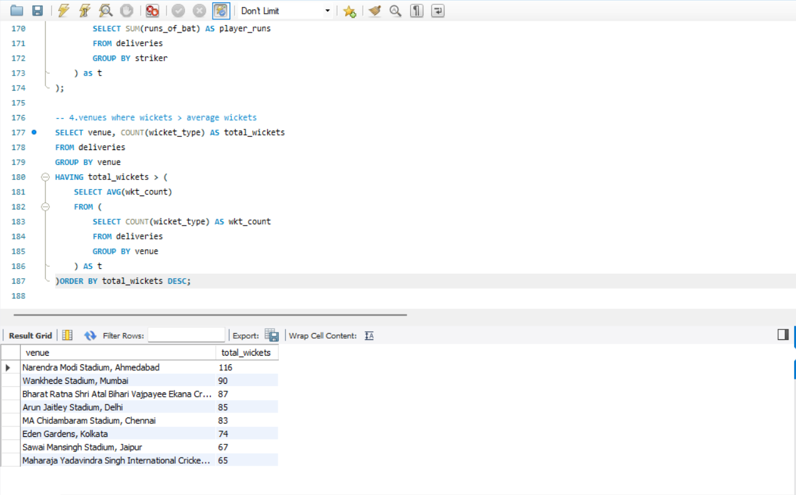

## 🏏 IPL 2025 Data Analysis Project (MySQL)
Analyzed IPL 2025 season data by importing Kaggle datasets into MySQL. Designed relational tables and implemented primary & foreign key constraints. Performed data cleaning and transformation, and wrote advanced SQL queries (JOINs, subqueries, CTEs, window functions) to analyze player and match performance. Generated insights such as total runs, wickets, averages, strike rates, and player rankings.

## 📌 Project Overview

This project analyzes IPL 2025 season data using MySQL.
The dataset was imported from Kaggle and structured into relational tables for analysis.

## 📂 Dataset

Source: Kaggle IPL 2025 dataset

Imported using MySQL Table Data Import Wizard

Tables Used:

matches

deliveries

orange_cap

purple_cap

## 🛠 Tools Used

MySQL

SQL (Basic Queries,Joins, Subqueries, CTEs, Window Functions)

## 📊 Analysis Performed

Total runs and wickets per match

Player performance analysis

Top Run Scorers and Top Wicket Takers

Player rankings using RANK() window function

Venue-based wicket insights

## 🧠 Key Concepts Used

Primary & Foreign Keys

Data Cleaning & Transformation

Aggregations (SUM, AVG, COUNT)

GROUP BY & HAVING

Subqueries

CTE (Common Table Expressions)

Window Functions

## 🎯 Project Goal

To transform raw IPL ball-by-ball data into structured insights using SQL queries.

## 🎯 Learning Outcomes

Strengthened SQL query writing skills

Improved understanding of relational databases

Identified Match-related insights

Determined top-performing players

Analyzed ball-to-ball-deliveries patterns

Developed ability to translate business questions into SQL queries

Gained Hands-On Experience in Write in Queries for Analysis

